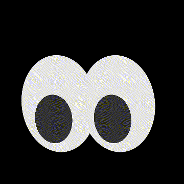

# 002. `eye`



**Date:** Tuesday, January 7th, 2020

A quick response from the [first project work](../001-pattern_shift) as someone suggest that the pattern looks like eyes. :eyes:

## How to run:
```bash
$ sh run.sh
```
