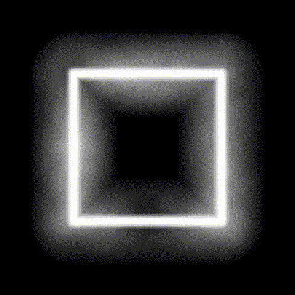

# 004. `cloudy_glow`



**Date:** Friday, January 10th, 2020

A first run using noise and creating glow via a signed distance function with undesirable result with edged shapes. There is an alternate circle version that is commented out in the [source file](./cloudy_glow.frag).

## How to run:
```bash
$ sh run.sh
```
