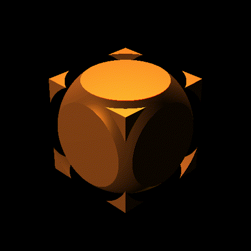

# 005. `ray_march-v01`



**Date:** Tuesday, January 14th, 2020

A first run of Ray-Marching following [this tutorial from Jamie Wong](http://jamie-wong.com/2016/07/15/ray-marching-signed-distance-functions/#the-raymarching-algorithm) which includes some signed-distance functions (SDFs) of Cubes and Spheres and dealing with intersections and unions.

I do want to try extending it to design fractals via Ray-Marching, though I do want to try cleaning the directories to allow imports of standard methods to shrink the file up.

## How to run:
```bash
$ sh run.sh
```
