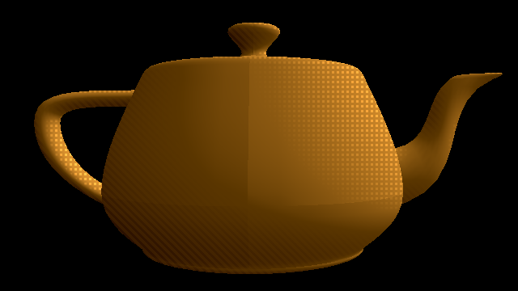

# 006. `masked_lighting`



**Date:** Sunday, January 26th, 2020

A stylized shading implementation that has dithering/half-tone for lighting and hatching on shadow. This is on the more rudimentary lighting where the model is unable to self-shadow, but the point is to fulfill the masked-lighting implementation.

This was inspired by a [series of tweets](https://twitter.com/i/events/1076925680489615361) by J. Tuason about how his team from _Insomniac Games_ implemented the dithering and half-tones for 2018's _Marvel's Spider-Man_.

## How to run:
```bash
$ sh run.sh
```

- Left Mouse Drag - Rotate around the object.
- Right Mouse Drag - Zoom in and out of the object.
